import Mermaid from '../../../../layouts/Mermaid.astro';

# How to create diagrams   and charts in Markdown?

## Mermaid lets you create diagrams and visualizations using text and code.

---

### Diagrams

#### Flowchart

##### Simple node

<Mermaid
  chart={`
    flowchart LR
      node
  `}
>

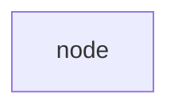

</Mermaid>

##### Square node

<Mermaid
  chart={`
    flowchart LR
      square[square node]
  `}
>

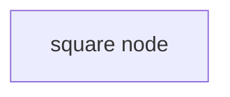

</Mermaid>

##### Round node

<Mermaid
  chart={`
    flowchart LR
      round(round node)
  `}
>

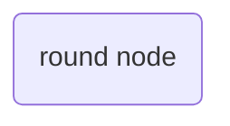

</Mermaid>

##### Pill node

<Mermaid
  chart={`
    flowchart LR
      stadium([pill node])
  `}
>

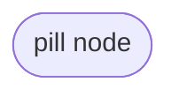

</Mermaid>

##### Subroutine node

<Mermaid
  chart={`
    flowchart LR
      subroutine[[subroutine node]]
  `}
>

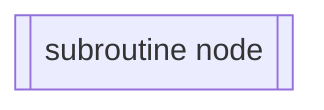

</Mermaid>

##### Cylindrical node

<Mermaid
  chart={`
    flowchart LR
      cylindrical[(cylindrical node)]
  `}
>

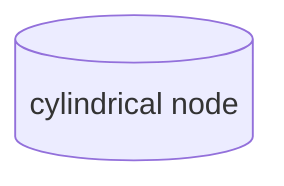

</Mermaid>

##### Circular node

<Mermaid
  chart={`
    flowchart LR
      circular((circular node))
  `}
>

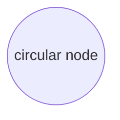

</Mermaid>

##### Asymmetric node

<Mermaid
  chart={`
    flowchart LR
      asymmetric>asymmetric node]
  `}
>

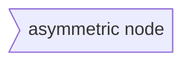

</Mermaid>

##### Rhombus node

<Mermaid
  chart={`
    flowchart LR
      rhombus{rhombus node}
  `}
>

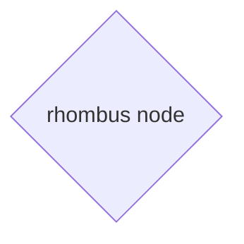

</Mermaid>

##### Hexagon node

<Mermaid
  chart={`
    flowchart LR
      hexagon{{hexagon node}}
  `}
>

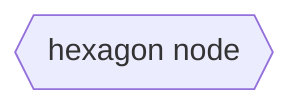

</Mermaid>

##### Right parallelogram

<Mermaid
  chart={`
    flowchart LR
      parallelogram_right[/right parallelogram node/]
  `}
>

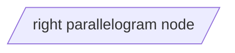

</Mermaid>

##### Left parallelogram

<Mermaid
  chart={`
    flowchart LR
      parallelogram_left[\\left parallelogram node\\]
  `}
>

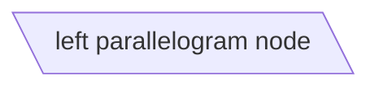

</Mermaid>

##### Down trapezoid

<Mermaid
  chart={`
    flowchart LR
      trapezoid_down[/down trapezoid node\\]
  `}
>

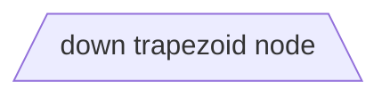

</Mermaid>

##### Up trapezoid

<Mermaid
  chart={`
    flowchart LR
      trapezoid_up[\\up trapezoid node/]
  `}
>

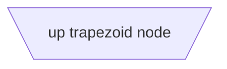

</Mermaid>

##### Double circular

<Mermaid
  chart={`
    flowchart LR
      double_circular(((double circular node)))
  `}
>

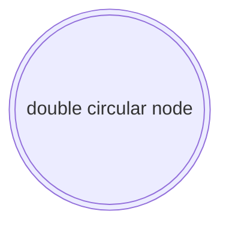

</Mermaid>

#### Sequence

#### Class

#### State

#### Entity Relationship

#### User Journey

#### Gantt

#### Pie chart

#### Requirement

#### Gitgraph

#### C4
