import Mermaid from '../../../../layouts/Mermaid.astro';

# How to create diagrams <br /> and charts in Markdown?

## Mermaid lets you create diagrams and visualizations using text and code.

---

### Flowchart

#### Node shapes

##### Simple node

<Mermaid
  chart={`
    flowchart LR
      node
  `}
>

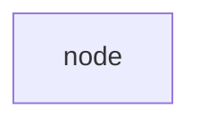

</Mermaid>

##### Square node

<Mermaid
  chart={`
    flowchart LR
      square[square node]
  `}
>

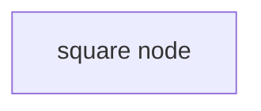

</Mermaid>

##### Round node

<Mermaid
  chart={`
    flowchart LR
      round(round node)
  `}
>

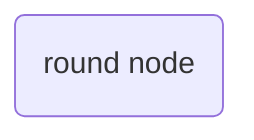

</Mermaid>

##### Pill node

<Mermaid
  chart={`
    flowchart LR
      stadium([pill node])
  `}
>


</Mermaid>

##### Subroutine node

<Mermaid
  chart={`
    flowchart LR
      subroutine[[subroutine node]]
  `}
>

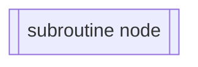

</Mermaid>

##### Cylindrical node

<Mermaid
  chart={`
    flowchart LR
      cylindrical[(cylindrical node)]
  `}
>

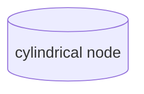

</Mermaid>

##### Circular node

<Mermaid
  chart={`
    flowchart LR
      circular((circular node))
  `}
>

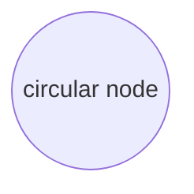

</Mermaid>

##### Asymmetric node

<Mermaid
  chart={`
    flowchart LR
      asymmetric>asymmetric node]
  `}
>

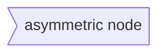

</Mermaid>

##### Rhombus node

<Mermaid
  chart={`
    flowchart LR
      rhombus{rhombus node}
  `}
>

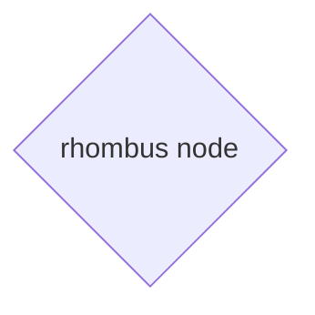

</Mermaid>

##### Hexagon node

<Mermaid
  chart={`
    flowchart LR
      hexagon{{hexagon node}}
  `}
>

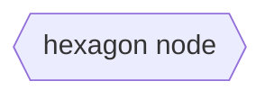

</Mermaid>

##### Right parallelogram node

<Mermaid
  chart={`
    flowchart LR
      parallelogram_right[/right parallelogram node/]
  `}
>

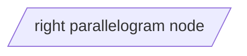

</Mermaid>

##### Left parallelogram node

<Mermaid
  chart={`
    flowchart LR
      parallelogram_left[\\left parallelogram node\\]
  `}
>

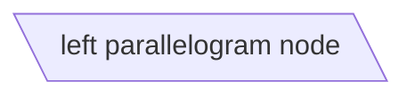

</Mermaid>

##### Down trapezoid node

<Mermaid
  chart={`
    flowchart LR
      trapezoid_down[/down trapezoid node\\]
  `}
>

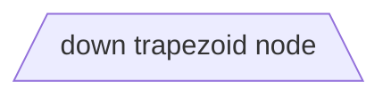

</Mermaid>

##### Up trapezoid node

<Mermaid
  chart={`
    flowchart LR
      trapezoid_up[\\up trapezoid node/]
  `}
>

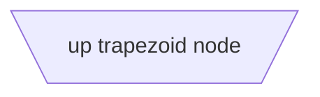

</Mermaid>

##### Double circular node

<Mermaid
  chart={`
    flowchart LR
      double_circular(((double circular node)))
  `}
>

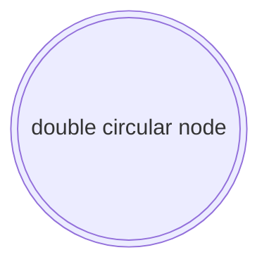

</Mermaid>

#### Node Connections

##### Link Types

###### Solid link

<Mermaid
  chart={`
    flowchart LR
      A --- B
  `}
>

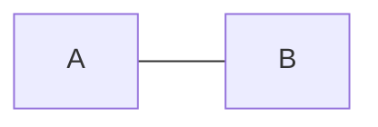

</Mermaid>

###### Dotted link

<Mermaid
  chart={`
    flowchart LR
      A -.- B
  `}
>

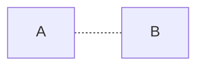

</Mermaid>

###### Thick link

<Mermaid
  chart={`
    flowchart LR
      A === B
  `}
>

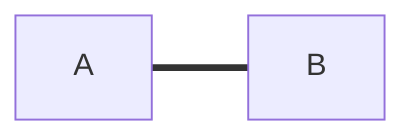

</Mermaid>

##### With description

###### Pipe syntax

<Mermaid
  chart={`
    flowchart LR
      A --->|description| B
  `}
>

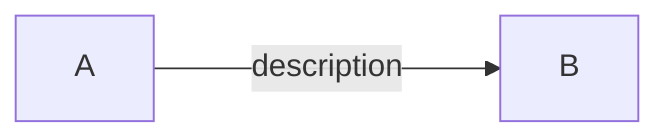

</Mermaid>

###### Between syntax

<Mermaid
  chart={`
    flowchart LR
      A --->|description| B
  `}
>

```mermaid
flowchart LR
  A --description-> B
```

</Mermaid>

##### Arrow heads

###### Default arrow

<Mermaid
  chart={`
    flowchart LR
      A --> B
  `}
>

```mermaid
flowchart LR
  A --> B
```

</Mermaid>

###### Start arrow

<Mermaid
  chart={`
    flowchart LR
      A --o B
  `}
>

```mermaid
flowchart LR
  A --o B
```

</Mermaid>

###### Close arrow

<Mermaid
  chart={`
    flowchart LR
      A --x B
  `}
>

```mermaid
flowchart LR
  A --x B
```

</Mermaid>

###### Multi directional arrows

<Mermaid
  chart={`
    flowchart LR
      A <--> B
      C o--o D
      E x--x F
  `}
>

```mermaid
flowchart LR
  A <--> B
  C o--o D
  E x--x F
```

</Mermaid>

#### Subgraphs

<Mermaid
  chart={`
    flowchart TB
      subgraph one[Label]
        A --> B
      end
      subgraph two
        C --> D
      end
      one --> two
  `}
>

```mermaid
flowchart TB
  subgraph one[Label]
    A --> B
  end
  subgraph two
    C --> D
  end
  one --> two
```

</Mermaid>

#### Interactions

<script>
  {`var callback = function () {
      alert('A callback was triggered');
  };`}
</script>

<Mermaid
  chart={`
    flowchart LR
      A-->B
      B-->C
      C-->D
      click A href "/en/posts/javascript/mermaid-js#how-to-create-diagrams--and-charts-in-markdown"
      click B href "https://www.github.com"
  `}
>

```mermaid
flowchart LR
  A-->B
  B-->C
  C-->D
  click A href "http://localhost:3000"
  click B href "https://www.github.com"
```

</Mermaid>

### Sequence

#### Syntax

##### Participants

<Mermaid
  chart={`
    sequenceDiagram
      participant Alice
      participant Bob
      Alice->>Bob: Hi Bob
      Bob->>Alice: Hi Alice
  `}
>

```mermaid
sequenceDiagram
  participant Alice
  participant Bob
  Alice->>Bob: Hi Bob
  Bob->>Alice: Hi Alice
```

</Mermaid>

##### Actors

<Mermaid
  chart={`
    sequenceDiagram
      actor Alice
      actor Bob
      Alice->>Bob: Hi Bob
      Bob->>Alice: Hi Alice
  `}
>

```mermaid
sequenceDiagram
  actor Alice
  actor Bob
  Alice->>Bob: Hi Bob
  Bob->>Alice: Hi Alice
```

</Mermaid>

##### Aliases

<Mermaid
  chart={`
    sequenceDiagram
      participant A as Alice
      participant J as John
      A->>J: Hello John, how are you?
      J->>A: Great!
  `}
>

```mermaid
sequenceDiagram
  participant A as Alice
  participant J as John
  A->>J: Hello John, how are you?
  J->>A: Great!
```

</Mermaid>

#### Arrows

<Mermaid
  chart={`
    sequenceDiagram
      A->B: Solid line without arrow
      A-->B: Dotted line without arrow
      A->>B: Solid line with arrowhead
      A-->>B: Dotted line with arrowhead
      A-xB: Solid line with a cross at the end
      A--xB: Dotted line with a cross at the end
      A-)B: Solid line with an open arrow at the end (async)
      A--)B: Dotted line with a open arrow at the end (async)
  `}
>

```mermaid
sequenceDiagram
  A->B: Solid line without arrow
  A-->B: Dotted line without arrow
  A->>B: Solid line with arrowhead
  A-->>B: Dotted line with arrowhead
  A-xB: Solid line with a cross at the end
  A--xB: Dotted line with a cross at the end
  A-)B: Solid line with an open arrow at the end (async)
  A--)B: Dotted line with a open arrow at the end (async)
```

</Mermaid>

#### Activations

<Mermaid
  chart={`
    sequenceDiagram
      A->>B: activate B
      activate B
      B->>+A: + A
      B->>-A: - B
      A->>B: deactivate A
      deactivate A
  `}
>

```mermaid
sequenceDiagram
  A->>B: B
  activate B
  B->>+A: B
  B->>-A: B
  A->>B: B
  deactivate A
```

</Mermaid>

### Class

### State

### Entity Relationship

### User Journey

### Gantt

### Pie chart

### Requirement

### Gitgraph

### C4
