import Mermaid from '@/components/Mermaid.astro';

# Como criar diagramas <br /> e gráficos com Markdown?

## Mermaid te permite criar diagramas e visualizações usando texto e código.

---

### Fluxograma

#### Formas de nós

##### simples

<Mermaid
  chart={`
    flowchart LR
      node
  `}
>

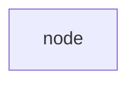

</Mermaid>

##### quadrado

<Mermaid
  chart={`
    flowchart LR
      square[square node]
  `}
>

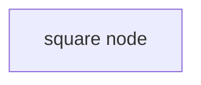

</Mermaid>

##### redondo

<Mermaid
  chart={`
    flowchart LR
      round(round node)
  `}
>

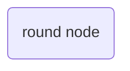

</Mermaid>

##### pílula

<Mermaid
  chart={`
    flowchart LR
      stadium([pill node])
  `}
>

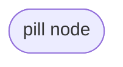

</Mermaid>

##### de sub-rotina

<Mermaid
  chart={`
    flowchart LR
      subroutine[[subroutine node]]
  `}
>

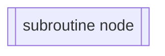

</Mermaid>

##### cilíndrico

<Mermaid
  chart={`
    flowchart LR
      cylindrical[(cylindrical node)]
  `}
>

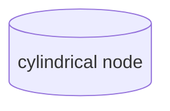

</Mermaid>

##### circular

<Mermaid
  chart={`
    flowchart LR
      circular((circular node))
  `}
>

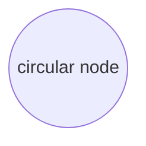

</Mermaid>

##### assimétrico

<Mermaid
  chart={`
    flowchart LR
      asymmetric>asymmetric node]
  `}
>

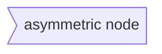

</Mermaid>

##### losango

<Mermaid
  chart={`
    flowchart LR
      rhombus{rhombus node}
  `}
>

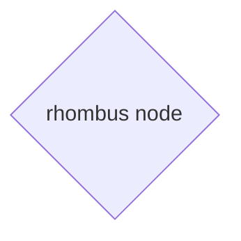

</Mermaid>

##### hexágono

<Mermaid
  chart={`
    flowchart LR
      hexagon{{hexagon node}}
  `}
>

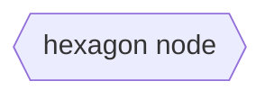

</Mermaid>

##### paralelogramo direito

<Mermaid
  chart={`
    flowchart LR
      parallelogram_right[/right parallelogram node/]
  `}
>

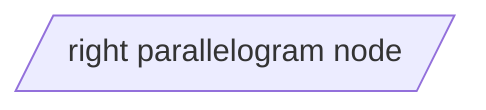

</Mermaid>

##### paralelogramo esquerdo

<Mermaid
  chart={`
    flowchart LR
      parallelogram_left[\\left parallelogram node\\]
  `}
>

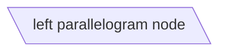

</Mermaid>

##### trapézio para baixo

<Mermaid
  chart={`
    flowchart LR
      trapezoid_down[/down trapezoid node\\]
  `}
>

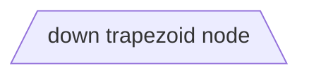

</Mermaid>

##### trapézio para cima

<Mermaid
  chart={`
    flowchart LR
      trapezoid_up[\\up trapezoid node/]
  `}
>

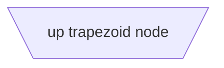

</Mermaid>

##### circular duplo

<Mermaid
  chart={`
    flowchart LR
      double_circular(((double circular node)))
  `}
>

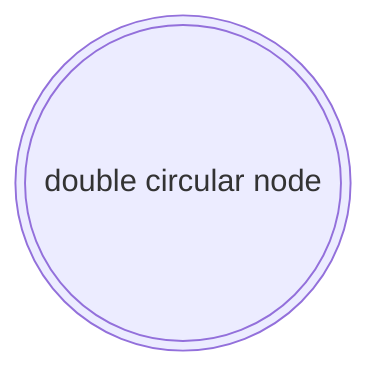

</Mermaid>

#### Conexões de nós

##### Tipos de links

###### Sólido

<Mermaid
  chart={`
    flowchart LR
      A --- B
  `}
>

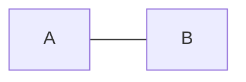

</Mermaid>

###### Pontilhado

<Mermaid
  chart={`
    flowchart LR
      A -.- B
  `}
>

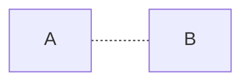

</Mermaid>

###### Espesso

<Mermaid
  chart={`
    flowchart LR
      A === B
  `}
>

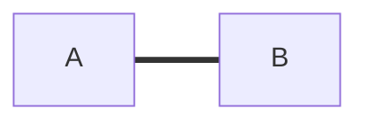

</Mermaid>

##### Com descrição

###### Sintaxe com pipe

<Mermaid
  chart={`
    flowchart LR
      A --->|description| B
  `}
>

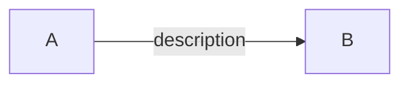

</Mermaid>

###### Sintaxe entre setas

<Mermaid
  chart={`
    flowchart LR
      A --->|description| B
  `}
>

```mermaid
flowchart LR
  A --description-> B
```

</Mermaid>

##### Pontas de flecha

###### Padrão

<Mermaid
  chart={`
    flowchart LR
      A --> B
  `}
>

```mermaid
flowchart LR
  A --> B
```

</Mermaid>

###### Início

<Mermaid
  chart={`
    flowchart LR
      A --o B
  `}
>

```mermaid
flowchart LR
  A --o B
```

</Mermaid>

###### Fim

<Mermaid
  chart={`
    flowchart LR
      A --x B
  `}
>

```mermaid
flowchart LR
  A --x B
```

</Mermaid>

###### Multi directional

<Mermaid
  chart={`
    flowchart LR
      A <--> B
      C o--o D
      E x--x F
  `}
>

```mermaid
flowchart LR
  A <--> B
  C o--o D
  E x--x F
```

</Mermaid>

#### Subgráficos

<Mermaid
  chart={`
    flowchart TB
      subgraph one[Label]
        A --> B
      end
      subgraph two
        C --> D
      end
      one --> two
  `}
>

```mermaid
flowchart TB
  subgraph one[Label]
    A --> B
  end
  subgraph two
    C --> D
  end
  one --> two
```

</Mermaid>

#### Interações

<script>
  {`var callback = function () {
      alert('A callback was triggered');
  };`}
</script>

<Mermaid
  chart={`
    flowchart LR
      A-->B
      B-->C
      C-->D
      click A href "/en/posts/javascript/mermaid-js#how-to-create-diagrams--and-charts-in-markdown"
      click B href "https://www.github.com"
  `}
>

```mermaid
flowchart LR
  A-->B
  B-->C
  C-->D
  click A href "http://localhost:3000"
  click B href "https://www.github.com"
```

</Mermaid>

### Sequência

#### Sintaxe

##### Participants

<Mermaid
  chart={`
    sequenceDiagram
      participant Alice
      participant Bob
      Alice->>Bob: Hi Bob
      Bob->>Alice: Hi Alice
  `}
>

```mermaid
sequenceDiagram
  participant Alice
  participant Bob
  Alice->>Bob: Hi Bob
  Bob->>Alice: Hi Alice
```

</Mermaid>

##### Atores

<Mermaid
  chart={`
    sequenceDiagram
      actor Alice
      actor Bob
      Alice->>Bob: Hi Bob
      Bob->>Alice: Hi Alice
  `}
>

```mermaid
sequenceDiagram
  actor Alice
  actor Bob
  Alice->>Bob: Hi Bob
  Bob->>Alice: Hi Alice
```

</Mermaid>

##### Apelidos

<Mermaid
  chart={`
    sequenceDiagram
      participant A as Alice
      participant J as John
      A->>J: Hello John, how are you?
      J->>A: Great!
  `}
>

```mermaid
sequenceDiagram
  participant A as Alice
  participant J as John
  A->>J: Hello John, how are you?
  J->>A: Great!
```

</Mermaid>

#### Setas

<Mermaid
  chart={`
    sequenceDiagram
      A->B: Solid line without arrow
      A-->B: Dotted line without arrow
      A->>B: Solid line with arrowhead
      A-->>B: Dotted line with arrowhead
      A-xB: Solid line with a cross at the end
      A--xB: Dotted line with a cross at the end
      A-)B: Solid line with an open arrow at the end (async)
      A--)B: Dotted line with a open arrow at the end (async)
  `}
>

```mermaid
sequenceDiagram
  A->B: Solid line without arrow
  A-->B: Dotted line without arrow
  A->>B: Solid line with arrowhead
  A-->>B: Dotted line with arrowhead
  A-xB: Solid line with a cross at the end
  A--xB: Dotted line with a cross at the end
  A-)B: Solid line with an open arrow at the end (async)
  A--)B: Dotted line with a open arrow at the end (async)
```

</Mermaid>

#### Ativações

<Mermaid
  chart={`
    sequenceDiagram
      A->>B: activate B
      activate B
      B->>+A: + A
      B->>-A: - B
      A->>B: deactivate A
      deactivate A
  `}
>

```mermaid
sequenceDiagram
  A->>B: B
  activate B
  B->>+A: B
  B->>-A: B
  A->>B: B
  deactivate A
```

</Mermaid>

### Classe

#### Sintaxe

<Mermaid
  chart={`
    classDiagram
      class BankAccount
      BankAccount : string owner
      BankAccount : number balance
      BankAccount : deposit(amount)
      BankAccount : withdrawal(amount)
  `}
>

```mermaid
classDiagram
  class BankAccount
  BankAccount : string owner
  BankAccount : number balance
  BankAccount : deposit(amount)
  BankAccount : withdrawal(amount)
```

</Mermaid>

#### Visibilidade

<Mermaid
  chart={`
    classDiagram
      class Visibility
      Visibility: +string public
      Visibility: -string private
      Visibility: #string protected
      Visibility: ~string internal
      Visibility: string static$
      Visibility: getStatic()$
      Visibility: getAbstract()*
  `}
>

```mermaid
classDiagram
  class Visibility
  Visibility: +string public
  Visibility: -string private
  Visibility: #string protected
  Visibility: ~string internal
  Visibility: string static$
  Visibility: getStatic()$
  Visibility: getAbstract()*
```

</Mermaid>

#### Relacionamentos

<Mermaid
  chart={`
    classDiagram
      classA --|> classB : Inheritance
      classC --* classD : Composition
      classE --o classF : Aggregation
      classG --> classH : Association
      classI -- classJ : Link(Solid)
      classK ..> classL : Dependency
      classM ..|> classN : Realization
      classO .. classP : Link(Dashed)
  `}
>

```mermaid
classDiagram
  classA --|> classB : Inheritance
  classC --* classD : Composition
  classE --o classF : Aggregation
  classG --> classH : Association
  classI -- classJ : Link(Solid)
  classK ..> classL : Dependency
  classM ..|> classN : Realization
  classO .. classP : Link(Dashed)
```

</Mermaid>

#### Cardinalidade / Multiplicidade nas relações

<Mermaid
  chart={`
    classDiagram
      Customer "1" --> "*" Ticket
      Student "1" --> "1..*" Course
      Galaxy --> "many" Star : Contains
  `}
>

```mermaid
classDiagram
  Customer "1" --> "*" Ticket
  Student "1" --> "1..*" Course
  Galaxy --> "many" Star : Contains
```

</Mermaid>

### Estado

#### Sintaxe

<Mermaid
  chart={`
    stateDiagram-v2
    direction LR
      [*] --> stateNode: transition
      stateNode --> [*]
  `}
>

```mermaid
stateDiagram-v2
direction LR
  [*] --> stateNode: transition
  stateNode --> [*]
```

</Mermaid>

#### Composição

<Mermaid
  chart={`
    stateDiagram-v2
    direction LR
      [*] --> mainState: transition
      state mainState {
        direction LR
        [*] --> subState
        state subState {
          direction LR
          [*] --> subSubState
          subSubState --> [*]
        }
        subState --> [*]
      }
      mainState --> [*]
  `}
>

```mermaid
stateDiagram-v2
direction LR
  [*] --> mainState: transition
  state mainState {
    direction LR
    [*] --> subState
    state subState {
      direction LR
      [*] --> subSubState
      subSubState --> [*]
    }
    subState --> [*]
  }
  mainState --> [*]
```

</Mermaid>

#### Choice

<Mermaid
  chart={`
    stateDiagram-v2
      state choice <<choice>>
      [*] --> condition
      condition --> choice
      choice --> false
      choice --> true
  `}
>

```mermaid
stateDiagram-v2
  state choice <<choice>>
  [*] --> condition
  condition --> choice
  choice --> false
  choice --> true
```

</Mermaid>

#### Forks

<Mermaid
  chart={`
    stateDiagram-v2
      state fork <<fork>>
      state join <<join>>
      [*] --> fork
      fork --> A
      fork --> B
      A --> join
      B --> join
      join --> [*]
  `}
>

```mermaid
stateDiagram-v2
  state fork <<fork>>
  state join <<join>>
  [*] --> fork
  fork --> A
  fork --> B
  A --> join
  B --> join
  join --> [*]
```

</Mermaid>

#### Anotações

<Mermaid
  chart={`
    stateDiagram-v2
      State1: The state with a note
      note right of State1
          Important information! You can write
          notes.
      end note
      State1 --> State2
      note left of State2 : This is the note to the left.
  `}
>

```mermaid
stateDiagram-v2
  State1: The state with a note
  note right of State1
    Important information! You can write
    notes.
  end note
  State1 --> State2
  note left of State2 : This is the note to the left.
```

</Mermaid>

#### Concorrência

<Mermaid
  chart={`
    stateDiagram-v2
    direction LR
    [*] --> concurrency
    state concurrency {
      direction TB
      [*] --> stateNode1: transition
      stateNode1 --> [*]
      --
      direction TB
      [*] --> stateNode2: transition
      stateNode2 --> [*]
    }
    concurrency --> [*]
`}
>

```mermaid
stateDiagram-v2
direction LR
[*] --> concurrency
state concurrency {
  direction TB
  [*] --> stateNode1: transition
  stateNode1 --> [*]
  --
  direction TB
  [*] --> stateNode2: transition
  stateNode2 --> [*]
}
concurrency --> [*]
```

</Mermaid>

### Relacionamento de entidade

#### Sintaxe

<Mermaid
  chart={`
    erDiagram
      CAR ||--o{ NAMED-DRIVER : allows
      PERSON ||--o{ NAMED-DRIVER : is
  `}
>

```mermaid
erDiagram
  CAR ||--o{ NAMED-DRIVER : allows
  PERSON ||--o{ NAMED-DRIVER : is
```

</Mermaid>

#### Relacionamentos

##### Um para um

<Mermaid
  chart={`
    erDiagram
      one ||--|| to-one : relationship
  `}
>

```mermaid
erDiagram
  one ||--|| to-one : relationship
```

</Mermaid>

##### Zero ou um

<Mermaid
  chart={`
    erDiagram
      zero-one |o--o| to-zero-one : relationship
  `}
>

```mermaid
erDiagram
  zero-one |o--o| to-zero-one : relationship
```

</Mermaid>

##### Zero ou mais

<Mermaid
  chart={`
    erDiagram
      zero-more }o--o{ to-zero-more : relationship
  `}
>

```mermaid
erDiagram
  zero-more }o--o{ to-zero-more : relationship
```

</Mermaid>

##### Um ou mais

<Mermaid
  chart={`
    erDiagram
      one-more }|--|{ to-one-more : relationship
  `}
>

```mermaid
erDiagram
  one-more }|--|{ to-one-more : relationship
```

</Mermaid>

#### Atributos

<Mermaid
  chart={`
    erDiagram
      CAR ||--o{ NAMED-DRIVER : allows
      CAR {
        string registrationNumber
        string make
        string model
      }
      PERSON ||--o{ NAMED-DRIVER : is
      PERSON {
        string firstName
        string lastName
        int age
      }
  `}
>

```mermaid
erDiagram
  CAR ||--o{ NAMED-DRIVER : allows
  CAR {
    string registrationNumber
    string make
    string model
  }
  PERSON ||--o{ NAMED-DRIVER : is
  PERSON {
    string firstName
    string lastName
    int age
  }
```

</Mermaid>

### Jornada do usuário

```mermaid
journey
  title My working day
  section Go to work
    Make tea: 5: Me
    Go upstairs: 3: Me
    Do work: 1: Me, Cat
  section Go home
    Go downstairs: 5: Me
    Sit down: 5: Me
```

<Mermaid
  chart={`
    journey
      title My working day
      section Go to work
        Make tea: 5: Me
        Go upstairs: 3: Me
        Do work: 1: Me, Cat
      section Go home
        Go downstairs: 5: Me
        Sit down: 5: Me
  `}
/>

### Gantt

#### Sintaxe

```mermaid
gantt
  default :a, 2022-10-08, 1w
  critical :crit, b, 2022-10-08, 1d
  active :active, c, after b a, 1d
  critical active :crit, active, ca, after c, 1d
  milestone : milestone, m1, 17:49, 2min
  milestone : milestone, m2, 18:14, 1d
```

<Mermaid
  chart={`
    gantt
      default :a, 2022-10-08, 1w
      critical :crit, b, 2022-10-08, 1d
      active :active, c, after b a, 1d
      critical active :crit, active, ca, after c, 1d
      milestone : milestone, m1, 17:49, 2min
      milestone : milestone, m2, 18:14, 1d
  `}
/>

### Gráfico de pizza

<Mermaid
  chart={`
    pie showData
      title Key elements in Product X
      "Calcium" : 42.96
      "Potassium" : 50.05
      "Magnesium" : 10.01
      "Iron" :  5
  `}
>

```mermaid
pie showData
  title Key elements in Product X
  "Calcium" : 42.96
  "Potassium" : 50.05
  "Magnesium" : 10.01
  "Iron" :  5
```

</Mermaid>

### Requisitos

#### Sintaxe

<Mermaid
  chart={`
    requirementDiagram
      requirement test_req {
        id: 1
        text: the test text.
        risk: high
        verifymethod: test
      }
      element test_entity {
        type: simulation
      }
      test_entity - satisfies -> test_req
  `}
>

```mermaid
requirementDiagram
  requirement test_req {
    id: 1
    text: the test text.
    risk: high
    verifymethod: test
  }
  element test_entity {
    type: simulation
  }
  test_entity - satisfies -> test_req
```

</Mermaid>

#### Requisito

<Mermaid
  chart={`
    requirementDiagram
      requirement test_req {
        id: 1
        text: the test text.
        risk: high
        verifymethod: test
      }
  `}
>

```mermaid
requirementDiagram
  requirement test_req {
    id: 1
    text: the test text.
    risk: high
    verifymethod: test
  }
```

</Mermaid>

Types:

- requirement
- functionalRequirement
- interfaceRequirement
- performanceRequirement
- physicalRequirement
- designConstraint

Risk:

- Low
- Medium
- High

Verification Method:

- Analysis
- Inspection
- Test
- Demonstration

### Gráfico do Git

```mermaid
%%{ init: { 'logLevel': 'debug', 'theme': 'dark' } }%%
gitGraph
  commit id: "initial commit"

  branch hom
  branch feat/button

  checkout feat/button
    commit id: "create button"
    commit id: "finish button"

  checkout hom
    merge feat/button

  checkout feat/button
    commit id: "fix hover"

  checkout hom
    merge feat/button

  checkout feat/button
    commit id: "fix accessibility"

  checkout hom
    merge feat/button

  checkout main
    merge hom
```

<Mermaid
  chart={`
    %%{ init: { 'logLevel': 'debug', 'theme': 'dark' } }%%
    gitGraph
      commit id: "initial commit"

      branch hom
      branch feat/button

      checkout feat/button
        commit id: "create button"
        commit id: "finish button"

      checkout hom
        merge feat/button

      checkout feat/button
        commit id: "fix hover"

      checkout hom
        merge feat/button

      checkout feat/button
        commit id: "fix accessibility"

      checkout hom
        merge feat/button

      checkout main
        merge hom

`}

> </Mermaid>
